# MODELBOX设计规格

## MODELBOX场景

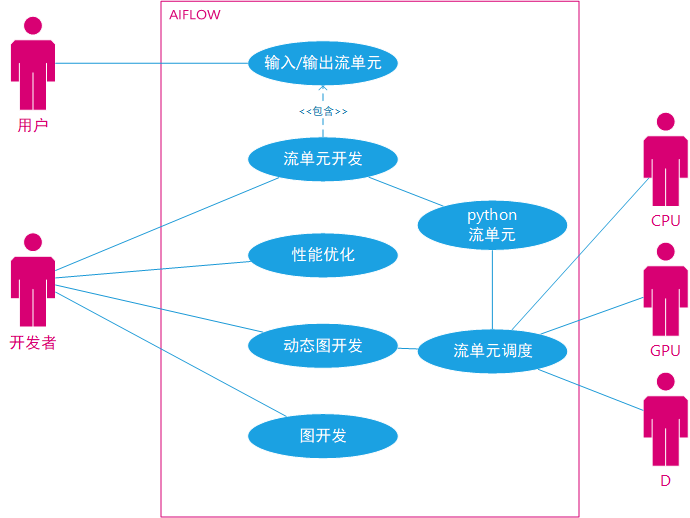

MODELBOX用例包含如下场景：

1. 数据输入，输出  
用户，数据输出，输出主要是来自业务的数据请求，业务下发请求给MODELBOX，MODELBOX将数据发送到GPU，D处理后，返回给用户。

1. 流单元开发  
开发者：开发者使用MODELBOX进行流单元开发，其中流单元开发以c++，python流单元为主。  
开发时，使用MODELBOX提供的开发接口。

1. 图开发  
开发者：开发者使用MODELBOX提供的Editor编辑器，编写对应格式的图，MODELBOX加载后，执行。

1. 性能优化  
开发者：开发者使用MODELBOX提供的profile能力，在执行流单元的时候，打开profiling接口，并导出profiling的数据，加载到chrome-tracing中，画出对应的性能甘特图。

1. 动态图开发  
开发者：开发者使用Notebook，使用python语言开发图，此时可以进行单步调试，开发完成后，业务使用动态图运行。

1. 流单元调度执行  
MODELBOX：MODELBOX加载对应的图以及流单元，将数据送入到CPU，GPU，D芯片中处理。

## MODELBOX架构

MODELBOX架构图：  

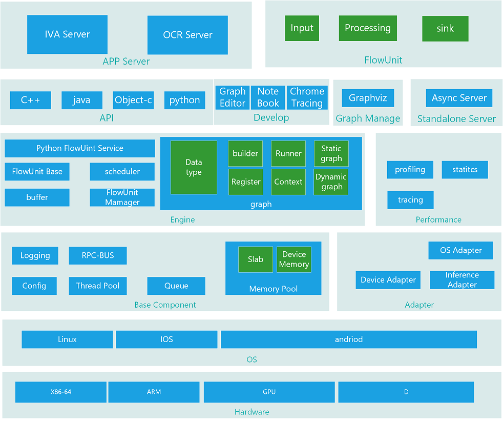

架构上，MODELBOX框架自底向上由如下组件构成：  

1. APP Server  
业务服务组件，包含IVA，OCR等服务组件，IVA为C++接口，OCR为python接口。  
其中IVA业务为异步业务，OCR为同步数据业务。

1. Flow Unit  
流集合，包含输入流单元，处理流单元，公共子流单元和数据整合流单元

1. Standalone Server  
可独立运行服务器，用于支撑业务的即时运行，业务用户不用从头开始开发进程，只需要开发对应的流单元代码，即可实现业务功能。

1. Develop  
开发支撑工具，包含Graph Editor, Notebook, Chrome Tracing，分别用于图开发，动态图写作和性能调优。

1. Graph Manage  
图管理接口，用于提供接口让开发这配置图的流程，和业务流程。  
graphviz用于图的展示和DOH图格式处理。

1. API  
对开发者提供的开发接口，支持C++，Java，Python，Object-c的开发。

1. Performance  
性能跟踪包含MODELBOX性能profiling，staticts打点，以及业务tracing。  
profiling支持性能打点，构造出业务的流程图，以及性能消耗。  
statics打点用于上次业务对业务进行打点，汇总上报执行接口。  
tracing用于特定业务的流程跟踪，输出。  

1. Engine  
引擎部分为MODELBOX的核心组件，包含了buff数据接口，flow unit base流单元接口，scheduler调度器，python 流单元接口和graph图。  
graph图包含了，builder图创建，runner图执行，Register图注册，Context图上下文，StaticGraph静态图，DynamicGraph动态图，Datatype数据已经数据类型。

1. Adapter  
适配层，适配底层OS和硬件差异。  
适配层包含OS适配，设备适配，推理适配。

1. Base Component  
基础组件，包含配置读取，线程池，日志，RPC总线，队列，内存池。
内存池，包含设备内存管理，slab内存分配器。

1. OS  
MODELBOX支持的OS有Linux，andriod，IOS。

1. Hardware  
MODELBOX包含支持X86-64，ARM64， GPU，D芯片硬件。

### AppServer


AppServer为对外服务适配的的业务组件。其功能为。

* 对外提供http api接口，用于任务控制。
* 提供插件机制，用于外部服务适配开发。

appServer内部，包含任务管理功能和状态查询功能。  
appServer外部导出接口有：

* 任务控制，任务的创建，删除，查询。
* 任务状态查询，查询任务的耗时，内存消耗。
* appserver进程统计信息，包含内存使用，CPU消耗，设备资源占用情况。

## modelbox发布件以及目录组织结构

modelbox发布件如下

| 发布件                                                         | 说明                                             |
| -------------------------------------------------------------- | ------------------------------------------------ |
| modelbox.&#91;deb&#124;rpm&#124;tar.gz&#93;                      | modelbox独立进程安装包，安装到系统中，可单独执行。 |
| libmodelbox.&#91;deb&#124;rpm&#124;tar.gz&#93;                   | modelbox核心库。                                   |
| libmodelbox-dev.&#91;deb&#124;rpm&#124;tar.gz&#93;               | modelbox开发支持，包含头文件，.a库                 |
| libmodelbox-device_cpu_dev.&#91;deb&#124;rpm&#124;tar.gz&#93;    | modelbox CPU开发支持，包含头文件，.a库             |
| libmodelbox-device_cuda_dev.&#91;deb&#124;rpm&#124;tar.gz&#93;   | modelbox CUDA开发支持，包含头文件，.a库            |
| libmodelbox-device_ascend_dev.&#91;deb&#124;rpm&#124;tar.gz&#93; | modelbox ASCEND开发支持，包含头文件，.a库          |
| modelbox.jar                                                     | java版本modelbox接口                               |
| modelbox.tar.gz                                                  | python pip package。                             |

modelbox目录结构如下

| 文件路径                    | 说明                   |
| --------------------------- | ---------------------- |
| /usr/bin/modelbox             | modelbox独立服务器主进程 |
| /etc/modelbox/modelbox.conf     | modelbox配置文件。       |
| /etc/modelbox/graph.conf      | modelbox执行程序图配置。 |
| /lib/systemd/modelbox.systemd | modelbox服务启动程序     |

libmodelbox目录结构如下

| 文件路径                                                         | 说明               |
| ---------------------------------------------------------------- | ------------------ |
| /usr/lib/libmodelbox.so                                            | modelbox开发库       |
| /usr/include/modelbox/                                            | modelbox头文件路径       |
| /usr/lib/libmodelbox/libmodelbox-device-&#91;cpu&#124;cuda&#124;ascend&#93;.so | modelbox开发库       |
| /usr/lib/libmodelbox/libmodelbox-uint-device-&#91;fu_xx.so&#93;      | modelbox流单元库路径 |

python开发包目录
| 文件路径                              | 说明                |
| ------------------------------------- | ------------------- |
| /usr/lib/python3/dist-packages/modelbox | modelbox python库路径 |

## Hardware

硬件上，CPU需要支持x86-64, ARM64，推理训练支持GPU，D芯片。  
在设计上，CPU部分的执行代码，需要支持跨平台执行。
GPU，D芯片的代码，需要支持可选，即：

1. MODELBOX框架支持x86-64，和ARM64.
1. MODELBOX GPU部分，D芯片部分可选。

## OS

OS上，需要支持标准Linux，andriod，iOS。
andriod，iOS支持NDK运行，所以在语言上，需要：

1. 接口部分：  
   接口部分需要支持JAVA，C++，Object-C, swift，python五种语言。

1. 框架部分：  
   框架部分采用c/c++语言开发：

1. 底层系统库：
   * Linux  
     使用标准的C++库，采用动态库的形式。需要编译配套OS的SDK。

   * Andriod  
     Andriod c++库对应的为libc++_shared.so，特别的使用了new delete同时需要连接/system/lib/libstdc++.so  
     依赖的系统库采用动态库的形式依赖。  
     异常支持，需要手工指定开启c++异常的支持。  
     语法支持，系统采用c++ 11的语法。  

   * iOS
     支持方式和Linux类似。

1. 适配接口：
   非posix标准的接口，采用适配的形式，比如线程优先级，进程资源占用接口等。

## Base Component

基础组件库是MODELBOX框架的公共功能，用于提供接口给上层框架、流单元开发，以及上层业务开发。
对应的基础组件列表如下：
基础组件，包含配置读取，线程池，日志，RPC总线，队列，内存池。
内存池，包含设备内存管理，slab内存分配器。

| 基础组件     | 功能说明                                                                                              |
| ------------ | ----------------------------------------------------------------------------------------------------- |
| toml配置读取 | 支持读取配置文件，格式采用toml，用于读取MODELBOX进程的启动参数                                          |
| 线程池       | 支持CPU资源调度，可以在给定线程数，优先级对指定的任务进行调度执行。                                   |
| 日志         | 异步日志，支持将日志输出到屏幕，指定的文件，或输出日志到上层业务日志模块。                            |
| 队列         | 阻塞队列，可设定队列的大小，当超过指定大小时，则阻塞。同时支持poll数据，有数据时，唤醒阻塞的线程。    |
| RPC总线      | 数据通信模块，支持异步RPC接口，数据格式使用protobuff格式。                                            |
| 内存池       | 管理MODELBOX使用的内存，这些内存包括CPU内存，GPU显存，D芯片内存，可配置指定大小的内存，并进行池化管理。 |
| slab分配器   | 对频繁使用对象的申请管理。                                                                            |

### 配置管理

MODELBOX框架，支持从配置文件中读取图运行的必要参数，这些参数包含对aflow框架的设置，设备层的配置，统计的配置等。  
MODELBOX默认使用toml配置接口  

对应的配置段如下：
| 配置项    | 功能说明 |
| ------------ | --------------|
| [global] | 全局配置|
| [device] | 设备相关的配置|
| [graph] | 图相关的配置|
| [driver] | driver相关的配置|

上述配置参数，采用点分结构，如：`device.cpu`，图相关的配置可以支持中类型的图。

### Logging

#### LIBMODELBOX框架

MODELBOX默认情况下，日志输出到屏幕，输出级别为ERROR级别的日志，业务组件可以注册日志处理函数，MODELBOX的日志将会输出到对应的业务组件模块。

对应日志输出的内容：

* 级别
* 行号
* 文件
* 函数名
* 日志内容。

MODELBOX日志组件在base中，日志接口可以提供给核心，业务，以及流单元插件调用。  
日志支持接口重定向，默认情况下输出到屏幕，业务可重定向日志接口到日志组件。  

#### MODELBOX进程日志

MODELBOX进程启动后，初始化日志组件，设置日志级别，文件信息，并将日志信息注册给MODELBOX框架。  
日志的输出由MODELBOX进程处理，将输出日志存储到本地磁盘上。  

MODELBOX进程默认将日志输出到`/var/log/modelbox/modelbox.log`目录中。

### RPC总线

RPC总线（或数据总线）主要用于系统内跨进程间的数据通信。初步选型使用grpc开源组件。同时在其上封装简易的异步接口。RPC调用的鉴权需预留接口，整体在鉴权系统中考虑。

## Adapter

底层适配层，适配层包含三部分适配，分别是硬件差异，OS差异，推理引擎差异。如下图所示：

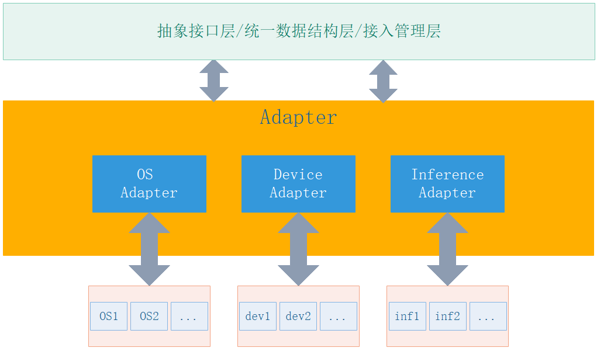

每种适配都有独立的抽象接口层、统一数据结构层及接入管理层，可实现动态插拔。

* 抽象接口层：每种适配都独立定义了抽象接口，不同类型的接入都需要独立实现抽象接口
* 统一数据结构：用于屏蔽不同接入的差异，在适配层之上作为元数据统一操作，需要在适配层对不同接入的数据做转
* 接入管理层：用于管理每种适配不同接入的动态插拔，动态插拔功能依赖抽象接口层、统一数据结构层

对每种适配的说明如下：

1. 硬件适配：  
硬件适配层主要区分有GPU和D芯片的适配，这部分适配接口为
   * 内存管理接口的适配
   * 设备资源占用率的适配

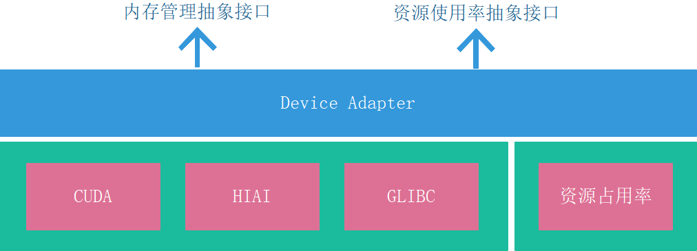

1. OS适配：  
API使用上，需要尽量避免Linux相关的接口，比如epoll之类的接口。  
其他方面，使用标准的系统库。  
第三方库，比如protobuf，rpc等使用静态编译的形式连接到ModelBox中。

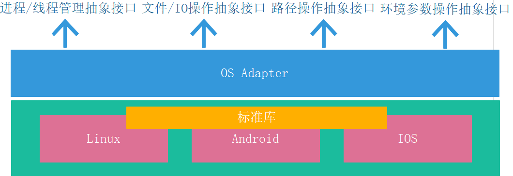

1. 推理引擎适配：  
为支持跨硬件平台推理，目前模型格式有pb，mo，me。在执行推理引擎接口标准化，不同的推理模型可以在不同的硬件上推理，比如同一个训练后的模型，可以在CPU，GPU，D芯片上执行。
推理引擎适配包含两部分；
    * 接口标准化  
      接口标准化为提供标准的推理接口。
    * 模型标准化  
      模型标准化为业务提供标准的模型，在不同设备上执行时，由推理适配层中的标准模型转换层转换为对应的模型后推理。

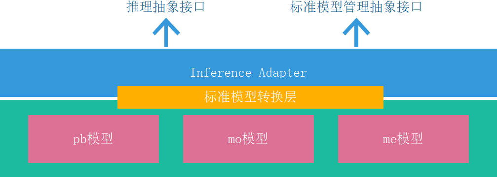

## Engine

Engine是MODELBOX的核心组件，MODELBOX的所有流单元调度运行全部有Engine负责，Engine有如下几个部分组成：

1. Buffer。  
基础数据，用于承载MODELBOX的处理数据。

1. Flow Unit Manager：  
流单元管理，负责根据图加载管理需要的流单元。

1. Flow Unit Base：  
流单元的基础结构，包含流单元的init，pre，post和run四部分。

1. Scheduler/`EngineCore`(名字待定，跟谷音讨论，暂时调度相关能力与Executor一起考虑，本处模块用于描述Engine的加载)：  
引擎调度程序，加载图，并启动线程池，按照业务请求生成上下文，并执行图的推理任务。  
`EngineCore`用于协调周边组件，是ModelBox实际运行的驱动器。其需要完成如下功能：
   * 根据外部传入的描述文件，构建完整图，使用Graph能力
   * 从Task列表中获取Task，构建Session级别的Context。图的执行器会从Context列表中获取Context进行执行

1. Python Flow Unit Service
python流单元服务程序，在使用纯python流单元时，python流单元代码将在独立的进程中执行以提高执行并发度。

1. graph：
图引擎，用于图的执行，其包含了Data/Type，builder，Runner，Register，Context，Static Graph，Dynamic Graph
    * DataType  
    数据接口，数据关联模块，对数据类型做强制检查和自动转换。  
    * builder  
    图创建接口，更具配置文件，建立图。
    * runner  
    图运行组件，按照图的拓扑排序执行每次推理任务。
    * Register  
    多图管理模块，可以对多个图进行管理。
    * Context  
    执行上下文，记录执行的状态，前后关联关系。
    * Static Graph
    静态图执行组件，按照静态图运行任务。
    * Dynamic Graph
    动态图执行组件，按照动态图执行任务。

### Buffer组成

Buffer为所有流单元的基础数据，其结构如下

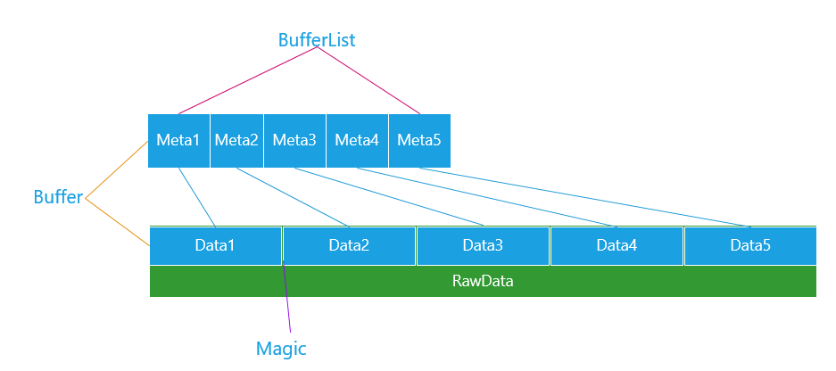

1. 一个Buffer由一个Meta和一个Data组成。  
Meta记录的此数据的类型，长度和对应数据的位置。
Data存储的对应的数据。

1. 多个Buffer组成一个BufferList。  
BufferList对应的Meta存储在一个List中，相应的数据，存储到同一个RawData中。

1. 数据保护  
Meta对应的Data存储到连续的RawData上，可能会导致误操作。RawData用Magic进行保护。

### Flow Unit Manager

1. 流单元开发

用户开发流单元时，只需要安装相应的流单元开发包libmodelbox-dev即可，安装完成后，modelbox的头文件将安装到`/usr/include/modelbox`中。

开发时：用户只需包含`modelbox/modelbox.h`即可开发，若开发对应设备的推理流单元，则包含对应的外设头文件`modelbox/device/[cpu|gpu|ascend]/modelbox.h`
编译时：用户指定编译参数`-shared -lmodelbox -lmodelbox-device-[cpu|gpu|ascend]`即可生成对应的modelbox流单元。

1. 流单元加载管理

流单元管理组件负责管理当前的所有流单元，并提供列表给图模块，同时在需要的时候进行流单元加载。
基本流单元应该包含基本的信息。

| 包含信息     | 信息说明                                   |
| ------------ | ------------------------------------------ |
| 文件路径     | 流单元文件路径，流单元的路径。             |
| 流单元名称   | 流单元的名称，加载流单元后执行             |
| 流单元版本号 | 流单元的版本号                             |
| 流单元输入   | 流单元输入个数，以及每个数据输入的类型。   |
| 流单元输出   | 流单元输出个数，以及每个输出的类型。       |
| 流单元参数   | 流单元参数列表，在图加载时执行流单元安装。 |

MODELBOX流单元路径可以如下：

| 路径             | 说明                                                           |
| ---------------- | -------------------------------------------------------------- |
| /usr/lib/modelbox/ | modelbox默认流单元库路径                                         |
| 图中指定         | 开发人员，可以在图中指定流单元库路径，在加载图的时候进行加载。 |

### Flow Unit Base

流单元基础接口，流单元的基础类，包含如下必要接口：

1. Open  
流单元加入图时，执行的一些配置参数，这些配置和图的执行相关。

2. StreamOpen  
当业务处理流数据时，触发调用streamopen，流单元打开流处理能力。

3. Process  
流单元执行接口，执行流单元，并返回对应的结果，如果流单元执行出错，返回对应的错误信息。

4. StreamClose
当业务流数据处理结束时，触发调用streamclose，通知业务关闭数据流。

5. close  
流单元销毁接口，销毁流单元时，释放对应的资源。

### 流单元的计算

流单元采用计算和流程分离的形式。

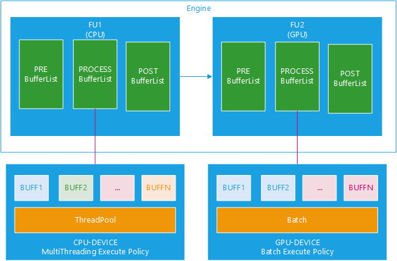

Engine调度执行buffer时，以bufferlist为单位调度，流单元中的pre，post以流单元为数据处理。  
当Engine执行对应的流单元时，执行策略由对应的device触发。采用业务流程和数据计算分离的模式。

* CPU的执行策略采用多线程+批量的形式。
CPU流单元可以设置批量处理能力，当业务处理时，会多线程方式批量处理数据。

* GPU的执行策略采用批处理的形式。
GPU采用全批量处理的能力。

### Scheduler

图调度器，用于并发执行图的任务使用，将数据从输入源调度到执行源，并对数据进行汇总后输出。

### Python Flow Unit Service

流单元并发调度任务，当流单元配置为纯python流单元时，由流单元管理模块启动相关的python服务。对应的工作模式如下：

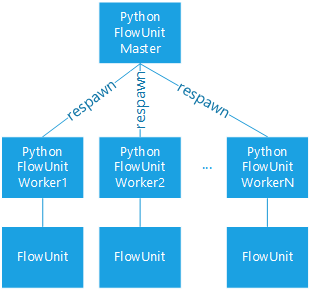

当有纯python流单元时，会经由python-master启动多个worker进程。相应的业务请求会由modelbox进程内部的Flow Unit将请求发送到python-worker，由python-worker进行并发处理后，返回给流单元。

### Graph

图引擎，为MODELBOX的关键组件，MODELBOX在创建图时，支持两种方式，一种是动态图，一种是静态图。
图支持一定的监控能力，可查询流单元数量，流单元执行次数等，同时结合Profiling，提供调优信息。

图的处理采用如下的方式。

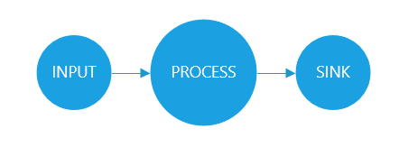

图的数据处理，采用从`INPUT`循环读取数据，并将数据送入`PORCESS`处理，处理完成后，由`SINK`输出。
Graph引擎包含了如下几部分：

#### 数据类型DataType

数据的流动校验采用的是DataType的方式。
对于DataType内置如下三种：

| 类型   | 类型说明                                                                                 |
| ------ | ---------------------------------------------------------------------------------------- |
| BUFF   | 基础类型，对应为BUFF，由数据长度                                                         |
| Tensor | Tensor类型，可支持多种shape，但调度框架的最小调度单位为tensor，而非tensor内部的N维数据。 |
| String | 字符串，字符串类型的数据。                                              |

数据类型采用数据类型树的方式匹配管理类型，大致的类型树如图：

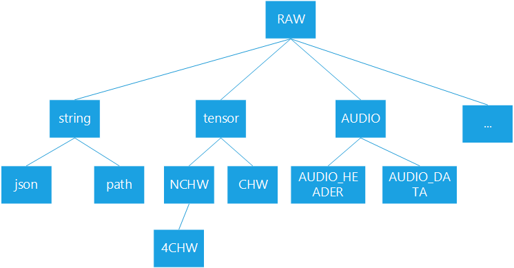

根节点为RAW类型，叶子节点基于RAW派生出来，可以子类型可以分为包含上述类型的多种数据类型。  

* 数据类型定义：
每个流单元可以自定义自己的数据类型，这些数据类型可基于上述三个类型扩展。每个流单元在初始化的时候，会注册对应数据类型，流单元管理器会对数据类型做校验判断。

* 流单元配置数据类型：
MODELBOX中数据类型采用树状结构进行管理。将继承关系描述清楚。同时数据类型会对外开放，流单元开发者可定义自己的数据类型，并纳入到树状管理结构中。  

* 数据类型校验：
图构建过程中，会对流单元的连接关系进行数据类型校验，此处校验为弱校验，允许父节点数据传递给子节点数据类型（等同编程语言的类型隐士转换）。流单元输入输出在流单元执行时进行强校验。

### builder

图主要包含Node，节点，对应流单元执行实体，与流单元处理函数绑定。每个Node具备输入、输出。输入与输出具备三个要素：名称、数据类型、详细描述。在可视化编排中，输入输出在Node上已短划线点表示（类似simulink）。图支持有向有环图，和子图。

图的生成主要完成图的建立。提供node添加接口、子图添加接口、node关联关系接口。关联关系添加时完成数据类型校验。

提供check接口，对构建完成的图进行进一步校验。规则主要有：

* 连接的流单元，输入输出数据类型匹配
* 不存在孤立流单元
* 流单元不存在孤立输入或输出

对应的图支持如下几种形式。

1. 形式一  
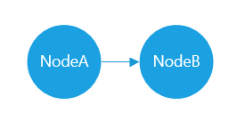

单流向，数据从NodeA->NodeB

1. 形式二  
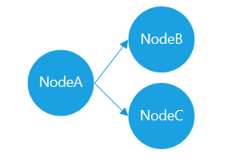

数据分流，数据从NodeA->NodeB, NodeA->NodeC

1. 形式三  
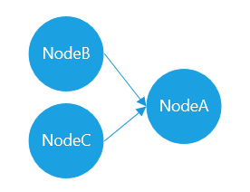

数据汇聚，数据从NodeB->NodeA, NodeC->NodeA

1. 形式四  
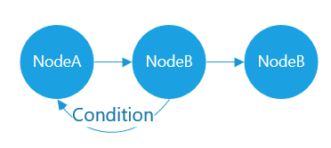

带条件Condition的边，可与之前的数据形成环状，对业务进行循环处理。

1. 形式五  


数据组合，数据有一个子图整体处理。NodeA->SubGraph->NodeC

#### D芯片流单元的支持

当前D提供了Matrix编程框架，该框架构建了一套完整的图模式。在图构建过程中需要对D芯片的编程模式进行封装。基本原则如下：

1. 针对使用D的业务逻辑，也封装为流单元。该流单元构建时会同时完成Hiai的图构建。流单元连接关系需对应转化为D模式下图的边。多个D芯片流单元组成子图。
1. D芯片子图图构建过程中在子图边界添加数据同步流单元。图执行过程中，D芯片流单元直接跳过或执行为空，由实际D Matrix的Graph 完成计算。
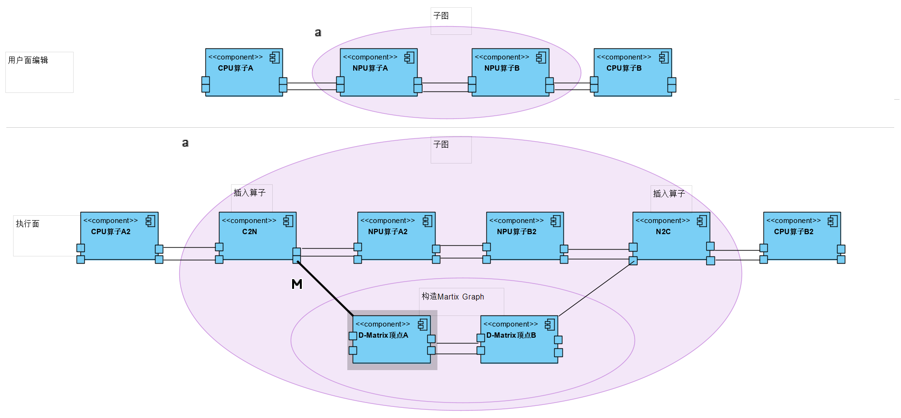

#### nvidia GPU的支持

nvidia显卡支持多路stream并发的计算，不同stream之间可以并发执行，同一个stream内部异步串行执行。
modelbox在支持nvidia显卡时，需要支持stream，stream的管理，跟踪由适配层的deivce和GPU 流单元负责。


streamid仅存在nVidia的GPU中。

* GPU初始创建一些stream池子。
* 当数据从其他设备复制到本GPU时，从池子中获取一个未使用的streamid，并调用nVidia的异步内存复制接口。
* 当数据在GPU中处理时，数据之间使用同一个streamid，并将streamid传递到后面的流单元中。
* 当数据从GPU复制回其他设备时，采用同步等待的形式等待数据复制完成。

### Context

Context上下文，为当前处理任务的情况，上下文主要提供流单元记录当前任务处理状态的能力，比如语音，视频等流式数据。
上下文分为两级上下文：

* 第一级是和图的生命周期绑定，为Session-Context。
* 第二级是从INPUT数据输入创建，到SINK结束回收，为Buffer-Context。

上下文包含如下内容：

1. 输入，输出数据指针
1. 执行序号。
1. 对应流单元的key-value状态数据存储。

### Runner

图执行器，负责使用调度器，调度对应图的流单元，调度策略为：

1. 对于INPUT流单元，采用线程池的形式调度， INPUT流单元产生数据上下文。
1. 对于PROCESS，SINK流单元，采用Schedule-With-Data的形式调度。
1. 对于GPU，D芯片需要批量处理的流单元，采用BufferList数据结合处理的形式。

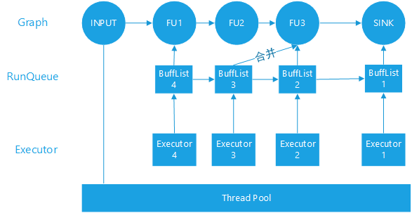

如上图所示：

* 一个图Graph分为5个Node，当由数据从INPUT产生时，INPUT产生的数据会放入一个RunQuene中。
* RunQueue按照执行数据由Executor调度执行，每个Executor都会和BufferList绑定。  
* Executor在执行OP时，会与后一个Buffer尽量做合并，将数据合并后给流单元处理。
* 最底层为公共线程池。

时序：  
RunQueue可设置为保序和非保序两种模式，当处理类似视频时序数据时，则保序执行。
当处理图片非顺序数据时，则可乱序执行。

### 动态图

动态图的执行是由主程序调度流单元执行，MODELBOX在执行时，需要将每一步的数据都返回给调用者。  
动态图执行和调用RPC接口类似，主程序调用接口后，由MODELBOX框架将数据送入对应的流单元，对应的流单元由Executor进行并发执行。
执行后的结果汇总后返回给调用点。

为优化动态图性能，如果动态图的结构是业务从将数据送入A流单元，立即需要B流单元，则数据不做传输动作。  
只有控制代码，需要读取操作数据时，才传输数据。

具体原理如下：


如上述动态代码为

```python
V1 = A()
V2 = B(V1)
V2.modify()
V3 = C(V2)
```

对于V1，因为主流程代码未使用，所以当调用B时，B直接从A处获取数据。
对于V2，因为主流程代码有修改，所以当要修改V2时，MODELBOX框架从B处将数据复制到MAIN处供main修改。
最后，C处理得修改后的数据。返回V3结果，V3的处理方式类似V1,V2

### 静态图

静态图的执行，主要的流程都有MODELBOX框架触发，只需要将最终结果返回调用者。
静态图是动态图的扩展，与动态图差别有：

1. 图的建立
图是在初期建立好的，静态图有全局图，动态图没有全局图。

2. 数据的处理
主程序不控制中间数据的处理，值由数据输入和数据输出要处理。

其他流程上基本一致，对流单元没有任何区别。

## Performance

性能跟踪包含Profiling，Staticts及Tracing三个模块。如下图所示：


1. Profiling  
Profiling由运行中流单元内置的代理定时收集指标数据，收集的指标包括：CPU使用率、内存使用率、消息处理CPU时间及实际用时、并发度等，利用收集的数据进行性能统计剖析，并提供导出接口可以为流单元生成一个性能剖析文件，可快速发现延迟和低效情况，有助于业务消除应用瓶颈并减少资源消耗量

2. Tracing  
Tracing用于全流程的调试跟踪，可以跟踪业务内部的消息传递情况，自动分析业务流程中所有流单元的跟踪记录，辅助业务快速确定问题的根本原因，主要是用在开发阶段，辅助跟踪任务的执行情况以及对应的日志信息。Tracing模块还提供导出接口导出tracing文件，可加载到chrome-tracing中，展示对应的甘特图

3. Statics  
Statics提供打点接口，用于上层业务对业务流程进行打点，汇总并统计展示执行结果，同时提供导出接口可以导出业务Statics打点数据

性能跟踪的整体流程如下图所示：

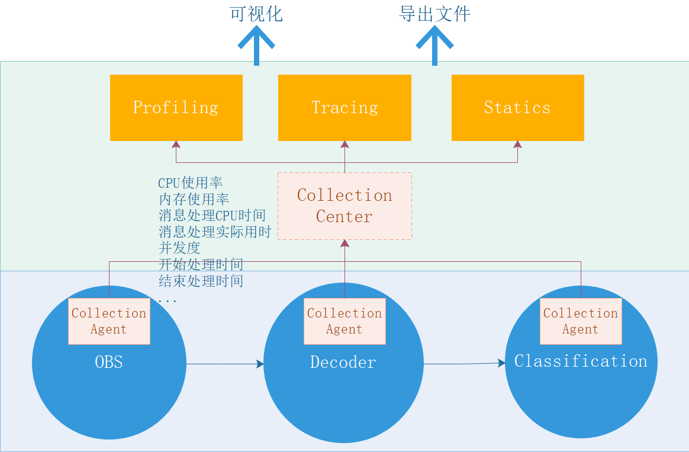

## API

## Thread Pool

主要包括线程生命周期管理，线程调度器和线程绑定器三个模块。如下图所示：


1. Lifecycle Manager  
线程生命周期管理器，管理线程生命周期，如创建线程，销毁线程

1. Scheduler  
线程调度器，线程具有优先级，调度器根据具体优先级调度，优先级范围1-10，值越低，优先级越高

1. Binder  
线程绑定器，提供简单API可以对线程进行绑核操作，提高线程运行效率，保证业务运行性能

## Memory Pool

Memory Pool用于屏蔽底层不同硬件环境下的内存操作，包括GPU、D芯片和普通内存，提供统一的内存池及内存操作接口，主要包括生命周期管理器、
内存高速交换、内存回收管理、日志跟踪、Slab内存分配和设备内存适配层六个模块。如下图所示：

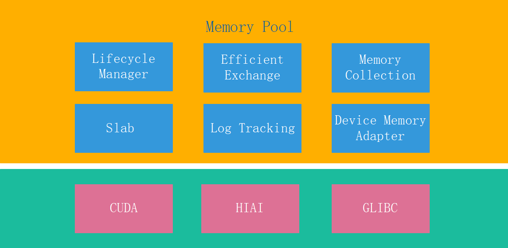

1. Lifecycle Manager  
内存池及内存的生命周管理，包括内存池及内存的创建和销毁，内存池的创建会优先保证内存是连续的，内存使用slab分配器分配，减少碎片产生

2. Efficient Exchange  
支持不同硬件设备环境下内存的高速交换，减少跨不同硬件环境下内存的拷贝次数和耗时

3. Memory Collection  
内存回收管理，通过一个计数器对对象进行计数，对象被引用时+1，引用失效时-1，当计数为0时则说明可以被回收，由该模块定时对计数为0的对象进行回收

4. Log Tracking  
内存操作的日志跟踪，如记录内存块分配的大小，总数，回收，方便追踪及统计内存的使用情况

5. Slab  
内存分配机制，slab分配器是基于对象进行管理，相同类型的对象归为一类，每当要申请一个对象，slab分配器就从一个slab列表中分配一个这样大小的单元出去，而当要释放时，将其重新保存在该列表中，而不是直接返回给系统，从而避免内存碎片产生

6. Device Memory Adapter  
设备内存适配层，屏蔽不同的硬件设备差异，提供统一的内存管理接口，不同的设备内存包括CUDA、HIAI及GLIBC

### CUDA stream

为更好利用cuda stream提供的并发能力，CUDA device层，支持cuda的stream接口。


使用CUDA stream的过程如下：

1. CUDA的设备层，创建一个`stream pool`，用于记录stream的句柄。
2. 当内存从CPU侧的FlowUnit复制到GPU时，CUDA device层从stream pool中创建stream，并将stream绑定到设备内存上。
3. 当CUDA调用核函数处理业务时，从设备内存获取到stream句柄，并触发异步业务。
4. 同一个任务，共享同一个stream。
5. 当结果从CUDA设备复制到HOST设备时，进行阻塞等待。

## Message Queue

消息队列用于传递事件和业务消息，在功能上，需要支持消息的：

* 泛型消息。
* 消息上限设置。
* 消息的BLOCKING，当队列满或空时阻塞请求。
* 消息POLLING机制，有消息时唤醒阻塞的任务。
* 超时机制，BLOCKING接口和POLLING接口支持超时能力。

消息队列消耗的内存来源于底层内存池，内存统计接口支持统计出消息的占用情况。

## Graph Manage

主要包含Graphviz、Interface和Subgraph Visualization功能模块，如下图所示：


1. Graphviz  
Graphviz用于图的可视化展示和DOH图格式处理。Graphviz是一个开源的图形可视化软件，具有web和交互式图形界面，以简单的文本语言描述图形，并以几种有用的格式绘制图形，如用于web页面的images和SVG、用于包含在PDF或其他文档中的Postscript、或显示在交互式图形浏览器中(Graphviz还支持GXL，一种XML方言)。Graphviz对于具体图表有许多有用的特性，比如颜色、字体、表格节点布局、行样式、超链接和自定义形状的选项。

2. Interface  
提供统一的图管理操作接口，让开发者快速地让配置、编排图的流程。图的管理接口包括静态图和动态图的管理。图的接口主要包含点及点属性的增删改查、边及边属性的增删改查、运行态图的启动和销毁等

3. Subgraph Visualization  
支持子图可视化、子图的导航及元数据展现。通过图形化界面可以快速展现各个嵌套子图的组成，还支持展现和导出各个子图的配置信息

## Develop

## Standalone Server

modelbox独立的运行服务器，用于帮助用户减少业务开发工作的独立进行组件，其功能是安装到OS中.
服务启动时，读取对应的服务配置文件，和图文件，加载对应的流单元来运行业务。

独立服务器流程：

1. 开发者下载MODELBOX安装包后，进行安装
2. 开发者配置MODELBOX的基本参数modelbox.conf。
3. 开发者按照图开发指导，开发graph.conf，并开发相应的流单元。
4. 开发完成后，配置modelbox读取对应的图和流单元。
5. 启动modelbox任务。
6. modelbox从输入流单元读取数据，并将数据推理后输出。

modelbox服务的启停，监控由systemd服务负责。

## Flow Unit

### 流单元接口

流单元根据运行的硬件设备不同划分为CPU流单元，CUDA流单元，HIAI流单元。它们继承自FlowUnitBase

其接口如下：

* open，close： 用于在图创建时，创建或关闭对应的流单元上下文
* pre，post：用于数据处理的预处理和后处理。
* process： 用于数据处理。

init函数提供了创建流单元对象的方法，并且提供了参数的检查方法。
流单元加载器会加载流单元对应的so文件，并且获取名为init函数的函数指针，并且调用它。从此获得了该流单元的名称, 流单元的create function, 支持的运行设备(CPU/CUDA/HIAI)以及版本号。

流单元的Setup()函数会在Initialize()函数之前调用，其主要是设置流单元的参数。

流单元的Initialize()函数根据Flow UnitOptions的配置初始化流单元实例，Flow UnitOptions的配置由用户在创建图的时候指定。

流单元的Process()根据当前运行的上下文执行流单元功能。Flow UnitContext包含当前流单元的运行环境，比如Inputs，Outputs，Context。

流单元的Destroy()函数在运行结束时释放资源。

### 流单元打包

流单元根据运行的设备不用，分别生成不同的so，例如Resize流单元分别有CPU的Reszie，CUDA的Resize，HIAI的Resize流单元，那么将分别生成modelbox_resize_cpu.so，modelbox_resize_gpu.so， modelbox_resize_hiai.so动态库。

MODELBOX根据用户指定的Device，或者自动根据当前的运行环境选择Device，
如果Device指定CPU，那么MODELBOX将动态加载modelbox_resize_cpu.so，如果Device指定CUDA，那么MODELBOX将动态加载modelbox_resize_gpu.so，如果在指定的路径下找不多对应的so，那么MODELBOX将返回失败。

### 流单元列表

MODELBOX需要提供尽可能多的流单元库

| 流单元名称           | 流单元类别   | 流单元功能说明                                                                                  |
| -------------------- | ------------ | ----------------------------------------------------------------------------------------------- |
| SyncHttp             | 输入类流单元 | 接收HTTP输入请求，并将请求的报文转发到后端流单元，待后端完成后，结果返回给对应的客户端。        |
| AsyncHttp            | 输入类流单元 | 接收HTTP输入请求，并将请求的报文转发到后端流单元。                                              |
| URLReader            | 输入类流单元 | 读取特定URL下的特定文件，并将数据输出到后续流单元，URL包含本地目录，obs目录，远端http文件。     |
| SyncQueue            | 输入类流单元 | 接收来自外部的数据，并将数据输出到后续流单元处理，后续流单元处理完成后，返回个等待的任务。      |
| AsyncQueue           | 输入类流单元 | 接收来自外部队列的数据，并将数据输出到后续流单元。                                              |
| DecodeImage          | 图像类流单元 | 解码图片。                                                                                      |
| EncodeImage          | 图像类流单元 | 编码图片。                                                                                      |
| Resize               | 图像类流单元 | 缩放图片，包括指定长宽，等比例缩放，按较短边等比例缩放，按较长边等比例缩放，等比例缩放padding。 |
| Rotate               | 图像类流单元 | 按指定的角度旋转图片。                                                                          |
| ColorSpaceConversion | 图像类流单元 | 转换图片的颜色空间，例如RGB转换成BGR。                                                          |
| Crop                 | 图像类流单元 | 根据给定的box抠图。                                                                             |
| HSV                  | 图像类流单元 | 设置图片的饱和度，透明度。                                                                      |
| Pad                  | 图像类流单元 | 用指定的值padding图片。                                                                         |
| BBoxPaste            | 图像类流单元 | resize bbox。                                                                                   |
| DecodeAudio          | 音频类流单元 | 解码Audio。                                                                                     |
| Reshape              | 数学类流单元 | 对Tensor进行Reshape。                                                                           |
| Normalize            | 数学类流单元 | 对Tensor进行Normalize。                                                                         |
| DecodeBase64         | 数学类流单元 | 解码Base64。                                                                                    |
| EncodeBase64         | 数学类流单元 | 编码Base64。                                                                                    |
| Cast                 | 数学类流单元 | 对Tensor进行类型转换，例如uint8转换float32。                                                    |
| Inference            | 数学类流单元 | 模型推理。                                                                                      |
| 同步输出流单元       | 输出类流单元 | 将数据原路输出，比如http rest请求时，需要等待推理完成后，再输出结果。                           |
| 文件流单元           | 输出类流单元 | 将结果输出到指定的位置。                                                                        |
| 队列流单元           | 输出类流单元 | 将结果输出到队列中。                                                                            |

## 动态图接口设计

作为入口函数， 主要提供了flowunits接口， 初始化ModelBox

| 函数                 | 参数 | 作用                              |
| -------------------- | ---- | --------------------------------- |
| ModelBox.Flowunits() |      | 创建Flowunits对象，初始化ModelBox |

flowunits: ModelBox的功能初始化接口:

| 函数                                                 | 参数                   | 作用|
| ----------------------------------- | ----------------------|---------- |
| Flowunits::init(flowunit_path, skip_default = false) | flowunit_path: 用户自定义的流单元路径 <br> skip_default: 是否跳过默认的流单元路径 | 加载并初始化流单元驱动|
| Flowunit::SetConfig(dict)               |                                      | 全局配置 |
| BufferList =  Flowunits::CreateInput() |                    | 创建输入的bufferlist                                    |

Flowunit算子：  flowunit作为Driver的具体单元，执行具体的功能执行

|函数                              | 函数参数说明                                             | 函数说明       |
| ------------------------------------------------------------ | -------------------------------------------------------- | -------------- |
| BufferSequenceMap = Flowunits.unit.FlowUnitName({portname: Buffer01 },  ... ，  option) | 输入为{PortName：Buffer}结构，输出为BufferSequenceMap | 输入输出都是多端口的话，则输入为｛portname：Buffer｝，输出为Map结构 |
| BufferSequenceMap= Flowunits.unit.FlowUnitName({portname: BufferSequence01,} ... ，  option) | 输入为{PortName：BufferSequence}结构，输出为BufferSequenceMap | 输入输出都是多端口的话，则输入为｛portname：BufferSequence｝，输出为Map结构 |
| BufferSequenceMap = Flowunits.unit.FlowUnitName({portname: BufferList01} , ... ，  option) | 输入为{PortName：Bufferlist}结构，输出为BufferSequenceMap | 输入输出都是多端口的话，则输入为｛portname：BufferList｝，输出为Map结构 |
| BufferSequenceMap = Flowunits.unit.FlowUnitName({portname: Stream01} , ... ，  option) | 输入为{PortName：Stream}结构，输出为BufferSequenceMap | 输入输出都是多端口的话，则输入为｛portname：Stream｝，输出为Map结构 |
| BufferSequence = Flowunits.unit.FlowUnitName({portname: Buffer01 },  ... ，  option) | 输入为{PortName：Buffer}结构，输出为BufferSequence | 只有一个输出，直接将输出转换为BufferSequence |
| BufferSequence = Flowunits.unit.FlowUnitName({portname: BufferSequence01},  ... ，  option) | 输入为{PortName：BufferSequence}结构，输出为BufferSequence | 只有一个输出，直接将输出转换为BufferSequence |
| BufferSequence = Flowunits.unit.FlowUnitName({portname: BufferList01},  ... ，  option) | 输入为{PortName：Bufferlist}结构，输出为BufferSequence | 只有一个输出，直接将输出转换为BufferSequence |
| BufferSequence = Flowunits.unit.FlowUnitName({portname: Stream01} , ... ，  option) | 输入为{PortName：Stream}结构，输出为BufferSequence | 只有一个输出，直接将输出转换为BufferSequence |
| BufferSequenceMap = Flowunits.unit.FlowUnitName( Buffer,   option) | 输入为Buffer，输出为BufferSequenceMap | 输入只有一个Buffer， 输出为BufferSequenceMap |
| BufferSequenceMap= Flowunits.unit.FlowUnitName(BufferList,   option) | 输入为BufferList，输出为BufferSequenceMap | 输入只有一个BufferList， 输出为BufferSequenceMap |
| BufferSequenceMap= Flowunits.unit.FlowUnitName(BufferSequence，  option) | 输入为BufferSequence，输出为BufferSequenceMap | 输入只有一个BufferSequence， 输出为BufferSequenceMap |
| BufferSequenceMap = Flowunits.unit.FlowUnitName(Stream，option) | 输入为Stream，输出为BufferSequenceMap | 输入只有一个Stream， 输出BufferSequenceMap |
| BufferSequence = Flowunits.unit.FlowUnitName(Buffer,  option) | 输入为Buffer，输出为BufferSequence | 输入只有一个Buffer， 只有一个输出为BufferSequence |
| BufferSequence = Flowunits.unit.FlowUnitName(BufferList,  option) | 输入为BufferList，输出为BufferSequence | 输入只有一个BufferList， 只有一个输出为BufferSequence |
| BufferSequence = Flowunits.unit.FlowUnitName(BufferSequence,  option) | 输入为BufferSequence，输出为BufferSequence | 输入只有一个BufferSequence， 只有一个输出为BufferSequence |
| BufferSequence = Flowunits.unit.FlowUnitName(Stream,  option) | 输入为Stream，输出为BufferSequence | 输入只有一个Stream，只有一个输出为BufferSequence |

基本数据结构：

Buffer：
| 函数和变量             | 作用                   |
| ---------------------- | ---------------------- |
| Buffer(data)           | 使用字符串初始化buffer |
| Buffer::PushBack(data) | 添加数据               |
| SetMeta  (dict)        | 设置Buffer Meta        |
| GetMeta  (key)         | 获取Buffer Meta        |

Stream： Flowunit的父类， 提供stream接口

| 函数                       | 作用                             |
| -------------------------- | -------------------------------- |
| __next__                   | 遍历包含的Buffer（支持in操作符） |
| __iterator__               | 迭代器，用于遍历Buffer           |
| BufferList GetBufferList() | 获取Stream包含的Bufferlist       |
| bool Stream::EOF()         | 判断流是否结束                   |
| Close()                    | 关闭bufferlist                   |
| PushBack(Buffer)           | 插入数据到BufferList尾部         |
| Buffer  PopFront()         | 取出buffer_list_中第一个的buffer |
| SetMeta  (dict)            | 设置BufferList Meta              |
| GetMeta  (key)             | 获取Stream Meta                  |

BufferList： Flowunit父类， 提供Bufferlist接口

| 函数               | 作用                             |
| ------------------ | -------------------------------- |
| PushBack(Buffer)   | 插入数据到BufferList尾部         |
| Buffer  PopFront() | 取出buffer_list_中第一个的buffer |
| [] At(Buffer)      | 获取buffer                       |
| __next__           | 返回值Buffer                     |
| __iterator__       | 迭代器，用例遍历Buffer           |
| Length()           | 获取BufferList的长度             |

BufferSequence: 表示流单元之间交互的单元， 作为Stream和 Bufferlist的子类

| 函数                        | 作用                                 |
| --------------------------- | ------------------------------------ |
| Stream = asStream()         | 转为Stream                           |
| BufferList = asBufferList() | 转为BufferList                       |
| Buffer = asBuffer()         | 转为Buffer                           |
| BufferSequence(Buffer)      |                                      |
| BufferSequence(BufferList)  |                                      |
| BufferSequence(Stream)      |                                      |
| SetMeta  (dict)             | 设置BufferList Meta                  |
| __next__                    | 用于遍历包含的Buffer（支持in操作符） |
| __iterator__                | 迭代器， 返回为Buffer                |

Demo如下:

```python
Import ModelBox 
flowunits = ModelBox.Flowunits();
if !flowunits.init({configuration}):
    log("failed init flowunits")
else:
    #  创建输入流，用于流单元的输入
    input = flowunits.CreateStream()  
    input.pushback({Buffer});
    input.close()

    # 创建encoder流， 用于encoder的输出
    encoder_stream = flowunits.CreateStream()
    
    # 将流绑定到Encoder， 用于encoder的输入
    flowunits.unit.VideoEncoder(encoder_stream, None)  
 
    # 将input绑定到VideoDemux，用于demux的输入
    demux_option = {"device": "cpu","device_id": 0}  # 使用dict设置Option 
    video_demuxer_output = flowunits.unit.VideoDemux(input, demux_option)  
    video_demuxer_stream = video_demuxer_output.asstream()
    
    video_decoder_output = flowunits.unit.VideoDecode(video_demuxer_stream, None) 
    video_decoder_stream = video_decoder_output.asstream()
    
    while video_decoder_stream.EOF():
        Bufferlist buffer_list = video_decoder_stream.GetBufferList()  
        if buffer_list.Length()!=0:
            infer_frame_output = flowunits.unit.InferFrame(buffer_list, None)
            infer_frame_list = infer_frame_output.asbufferlist()
            frame_list = flowunits.unit.Expand(infer_frame_list, None).asbufferlist()
            for frame in frame_list:
                word_list =  flowunits.unit.WordInfer(frame_list[i], None).asbufferlist()
                draw_pic = flowunits.unit.DrawWord({"input1": word_list, "input2" :buffer_list}, None).asbufferlist()
                encoder_stream.pushBack(draw_pic) # 向Encoder的输入流中填充数据
            #...
    encoder_stream.close()
```

精简写法：

```python
Import ModelBox 
flowunits = ModelBox.Flowunits()

if !flowunits.init({configuration}):
    log("flowunit init failed")
else:
    input  = flowunits.CreateStream()
    input.pushBack({Buffer}) 
    input.close()
    
    encoder_stream  = flowunits.CreateStream() # 创建encoder流， 用于encoder的输出
    
    demux_option = {"device": "cpu","device_id": 0}
    video_demuxer_output = flowunits.unit.VideoDemux(input, demux_option)  
    video_decoder_output = flowunits.unit.VideoDecode(video_demuxer_output, None) //  首先读取video_demux的config

    flowunits.unit.VideoEncoder(encoder_stream, option)
    
    for buffer in video_decoder_output:
        infer_frame_output = flowunits.unit.InferFrame(Buffer,None)
        frame_list = flowunits.unit.Expand(infer_frame_output, None)
        
        for frame in frame_list:
            word_list =  flowunits.unit.WordInfer(frame,  None)
            draw_pic = flowunits.unit.DrawWord({"input1": word_list, "input2" :buffer_list}, None)
            encoder_stream.pushBack(draw_pic)
            #...
    encoder_stream.close()

```
